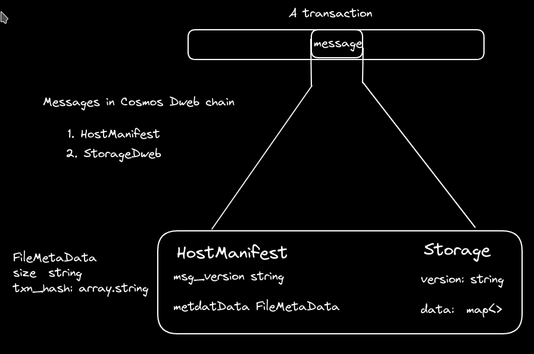
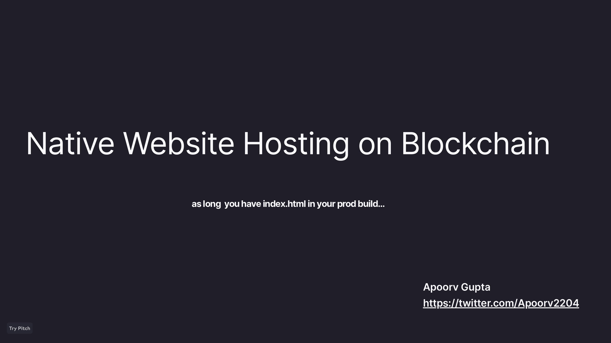
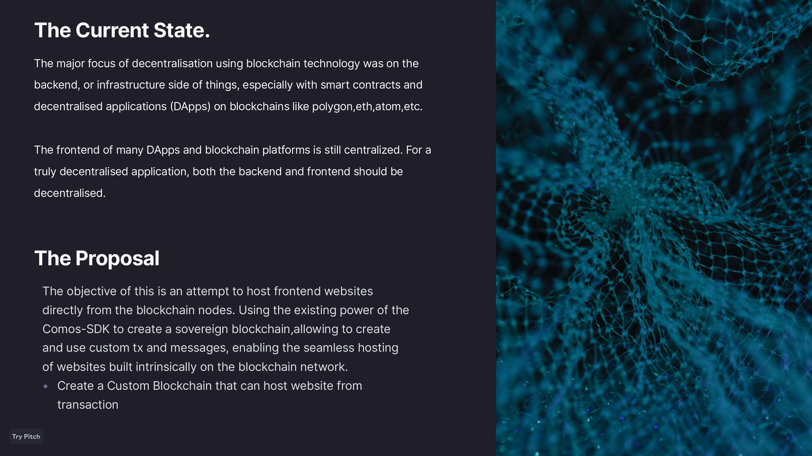
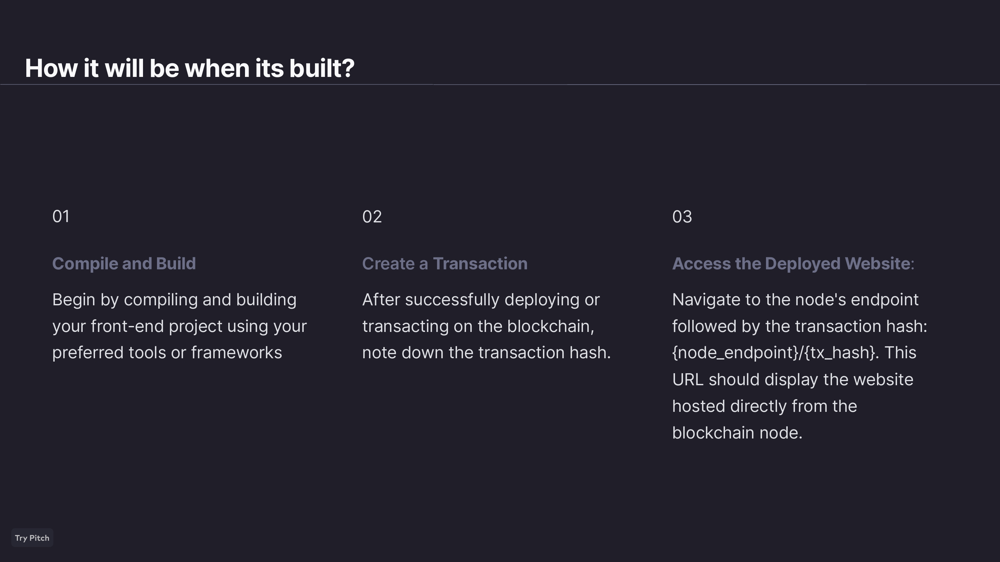
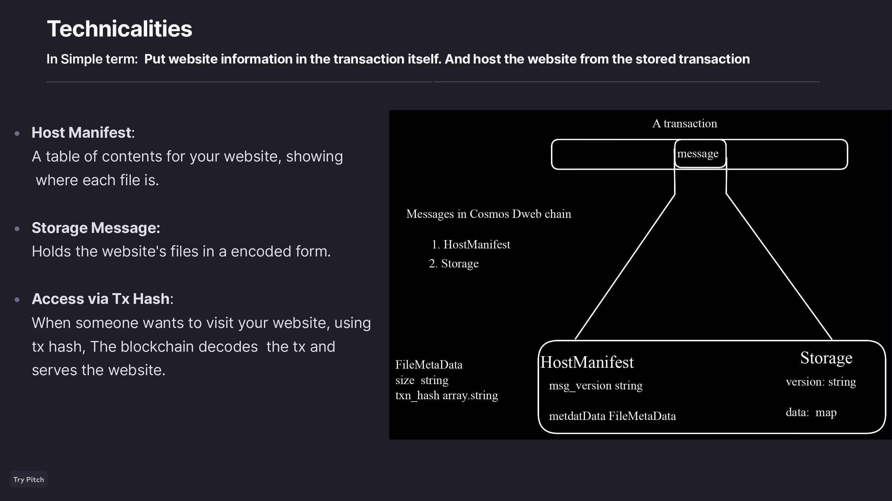
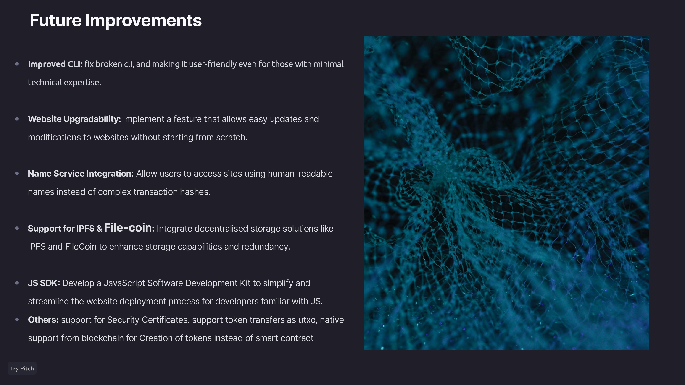
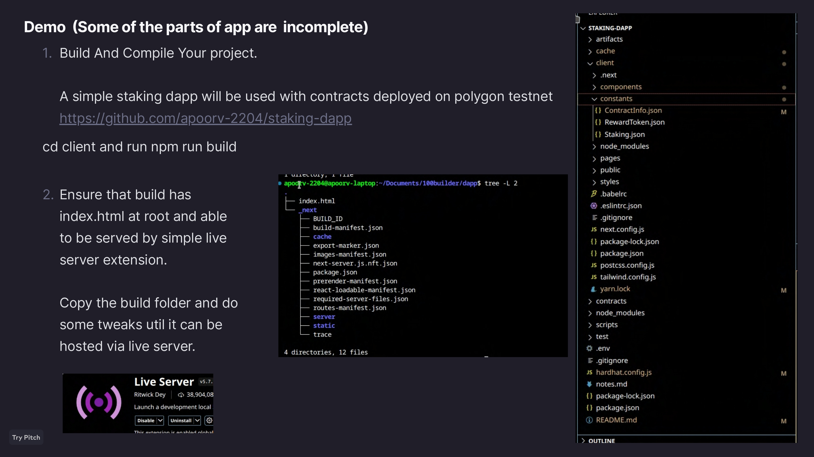
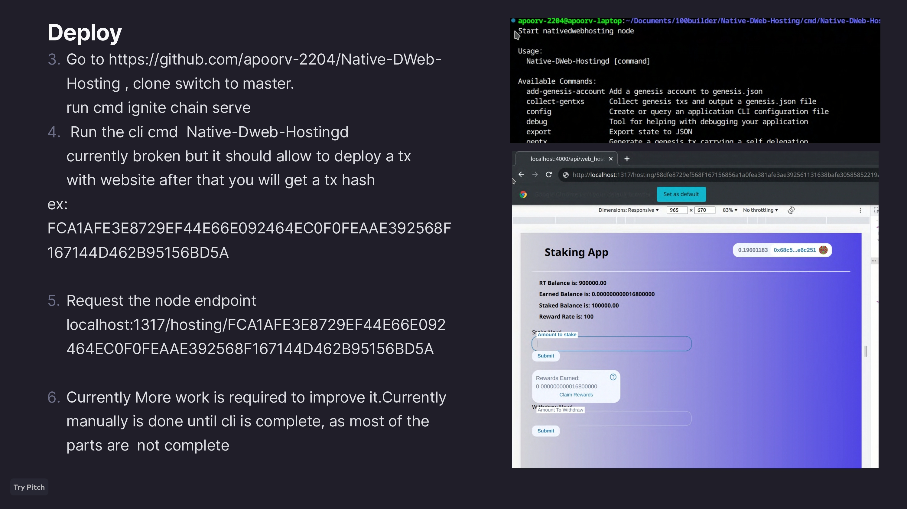

# Native Website Hosting on Blockchain 
Part of 100 builders 

## ** minimum viable product is not yet completed **

## The Current State.
The major focus of decentralisation using blockchain technology was on the backend, or infrastructure side of things, especially with smart contracts and decentralised applications (DApps) on blockchains like polygon,eth,atom,etc.

The frontend of many DApps and blockchain platforms is still centralized. For a truly decentralised application, both the backend and frontend should be decentralised.

## The Proposal
The objective of this is an attempt to host frontend websites directly from the blockchain nodes. Using the existing power of the Comos-SDK to create a sovereign blockchain,allowing to create and use custom tx and messages, enabling the seamless hosting of websites built intrinsically on the blockchain network.

Create a Custom Blockchain that can host website from transaction

---

---

## info

  
 ---
 
 ---
 
---
 
---
 
---
 
---
 
---
 
---
